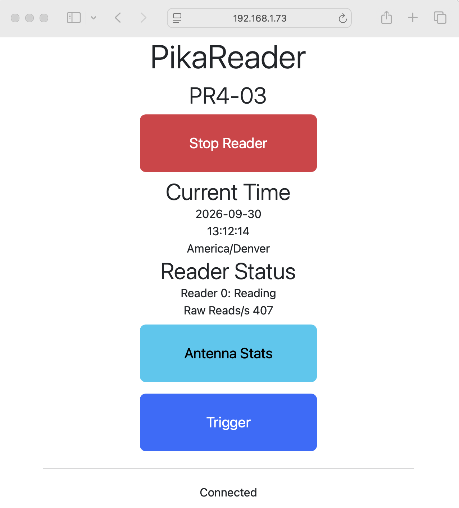
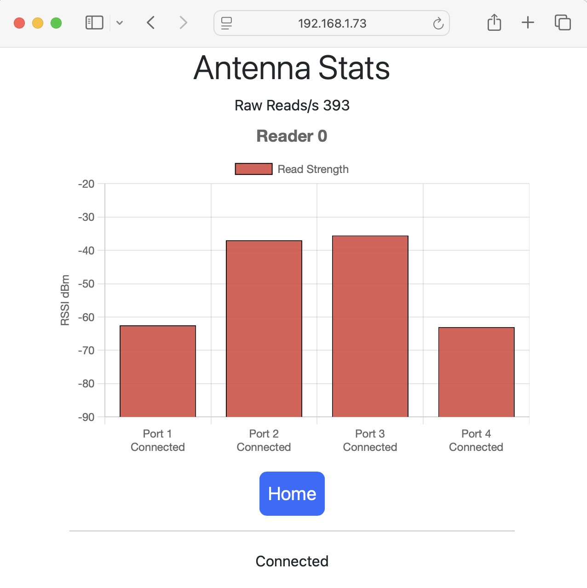

# PikaReader: OpenSource RFID Reader

***

PikaReader is intended to sit on a small single board computer (Raspberry Pi, etc) and connect to a local RFID Readers such as an Impinj R420.
The intent is to eliminate the typical "Single Point of Failure" modes we see when a timing application connects directly to a raw RFID reader.
By pairing a PikaReader instance with each RFID Reader with a dedicated network cable to the RFID Reader, the primary timing laptop can go offline and the timer will not lose any data as a result. 

The system supports a "rewind" function that allows the PikaReader system to collect tag reads that can later be downloaded and imported into a timing application (PikaTimer, RaceDay Scoring, etc). 
This allows for remote and offline readers for on-course splits or remote starting lines. 

## Current Features
* Web based status and control (start/stop reading, trigger).
* Support for Impinj R420 readers (via Octane 3.x SDK).
* Ability to store and "rewind" tag reads for later retrieval by the timing application.
* Live streaming of tag reads via a websocket to a timing application or the [PikaDownloader](https://github.com/PikaTimer/PikaDownloader/) app.
* Per-antenna read stats via status api and real time web display.
* User configurable gating to reduce the number of tags transmitted to the timing application.
* Debug log available via built in http server.
* Antenna Status Display via web UI.
* Support for both Decimal and Hex encoded tags.
* Support for a "trigger" that can be used to drop a special "0" chip read to use to mark the start of a race. 

## Additional Notes
* Use the [PikaDownloader](https://github.com/PikaTimer/PikaDownloader/) app to download data from the reader to a local text file.
* See the [PikaReader4Pi](https://github.com/PikaTimer/PikaReader4Pi) project for an example of building a small standalone reader.

## Planned 
* Integration with PikaTimer application 
* Integration with PikaRelay for remote retrieval of data
* Support for additional IP Based Readers:
    * Impinj R700 (both LLRP and REST/I2C based)
    * Zebra / Mororola FX Series 
* Support for UART based readers (TSL and ThingMagic/Jadak )
* Support for generic LLRP Readers
* Web Based configuration tool

## Screen Snapshots

*Main Web Interface:*

*Antenna Stats:*

## Usage
Requires OpenJRE 21 or newer. 

Launch the jar file: java -jar PikaReader.jar 

Press the space bar to stop. 

The default web UI port is http on port 8080. 
You can use the web based UI to start or Stop the reader or create a "trigger" to mark an event such as the start of a race. 

HTTP paths for basic system status and information
- `/` -- Basic System information and web UI for control of PikaReader 
- `/antennaStatus` -- Show the current antenna port stats

REST api paths:
- `/start` -- Start the reader
- `/stop` -- Stop the reader
- `/rewind` -- rewind all data from PikaReader
- `/rewind/<from>` -- Rewind all data after <from> date/time. Time in ISO format (YYYY-MM-DDTHH:MM:ss)
- `/rewind/<from>/<to>` -- Rewind data between from and to
- `/debug` -- Dump the debug log to the browser
- `/trigger` -- Record a "trigger" time (chip = 0, reader = 0, antenna = 0) to mark an event
- `/status` -- dump the current reader status

Websocket (ws://)
- `/status` -- sends a message once a second with the current reader status
- `/events` -- send a message for each read or status update

## Notice!
The first time the app is run, it will automatically create a basic config file. 
You will need to quit PikaReader and then edit the ~/.PikaReader.conf file to configure the app. 
Once this is done you can restart the app and being using it. 

